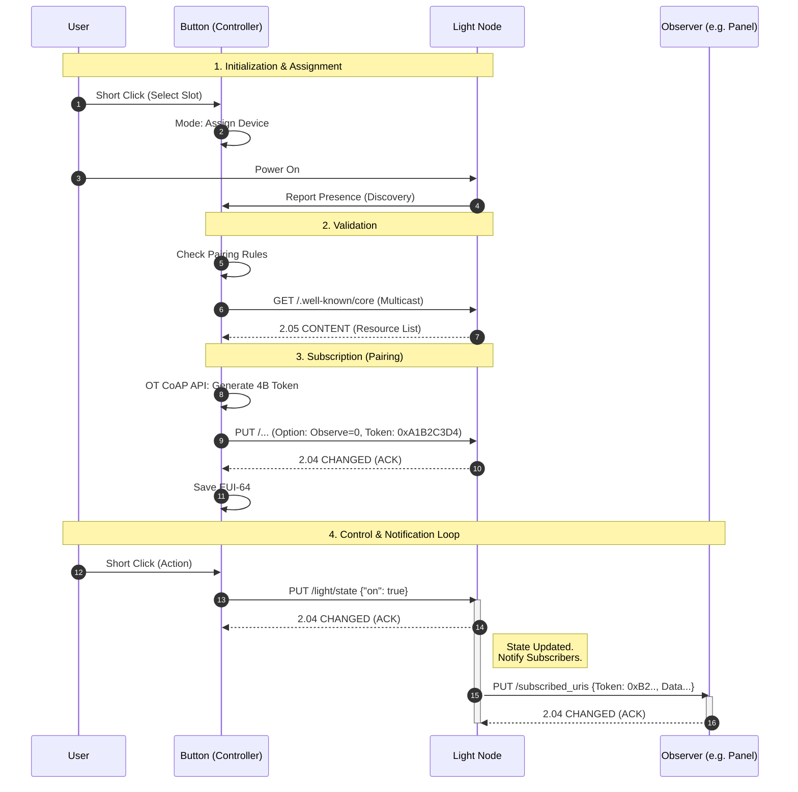

# OTApp - OpenThread Application Framework


<details><summary><b>🇵🇱 Wersja Polska</b></summary><br>

> **Kompletna dokumentacja techniczna, diagramy oraz opis API dostępne online:**
> 📚 [**https://hareo.pl/otapp/**](https://hareo.pl/otapp/)

## 💡 O Projekcie

**OTApp** to kompleksowy framework middleware stworzony do budowy urządzeń IoT opartych na sieci **Thread**. Stanowi warstwę abstrakcji pomiędzy stosem OpenThread/CoAP a sprzętem, umożliwiając szybkie tworzenie inteligentnych urządzeń, takich jak przyciski, oświetlenie czy czujniki.

Projekt rozwiązuje problem skomplikowanej konfiguracji sieci mesh, oferując gotowe mechanizmy **automatycznego parowania (discovery)**, grupowania urządzeń (Device Name Groups) oraz komunikacji asynchronicznej opartej na protokole **CoAP**.

## 🔌 Dostępne Platformy

| MCU            | Toolchain       | Repo         |
|----------------|-----------------|--------------|
| **ESP32-C6**   | ESP-IDF v5.x   | **[ github.com/HareoPL/ot_app_esp](https://github.com/HareoPL/ot_app_esp)** |
| **STM32WBA65RI**| STM32CubeIDE  | **[github.com/HareoPL/ot_app_stm](https://github.com/HareoPL/ot_app_stm)** |
| **STM32H7+ESP32** | **VSCode+ST HAL** | **[github.com/HareoPL/ot_app_cp](https://github.com/HareoPL/ot_app_cp)** |


## 🛠 Technologie

* **Język:** Embedded C z elementami obiektowości.
* **Platforma:** ESP32-C6 (RISC-V), STM32WBA65RI (Arm® Cortex®-M33).
* **SDK:** ESP-IDF v5.4.1, HAL V1.8.0.
* **Protokoły:** OpenThread (Thread Mesh), CoAP, IPv6.
* **OS:** FreeRTOS.
* **Build System:** CMake / Ninja.
* **Dokumentacja:** Doxygen + Graphviz.
### Kluczowe funkcjonalności:
* ✅ **Device Abstraction Layer:** Ujednolicone API dla różnych typów urządzeń (Button, Light, Sensor).
* ✅ **Auto-Discovery & Pairing:** Automatyczne wykrywanie i parowanie urządzeń bez udziału użytkownika (Zero-Touch Provisioning).
* ✅ **Pairing Rules & Logic Validation:** System reguł określających dozwolone interakcje między typami urządzeń (whitelist). Framework weryfikuje zgodność urzadzen przed sparowaniem (np. blokuje połączenie `Sensor` <-> `Sensor`), zapewniając logiczną spójność topologii sieci.
* ✅ **Device Grouping & Zoning:** Logiczna segmentacja sieci na strefy sterowania (np. `kitchen`, `living-room`) oparta na prefiksach nazw urządzeń.
* ✅ **CoAP Observe:** Obsługa subskrypcji i notyfikacji zmian stanu w czasie rzeczywistym (RFC 7641).
* ✅ **Architektura zdarzeniowa:** System oparty na callbackach i asynchronicznym przetwarzaniu zadań (Producer-Consumer).
* ✅ **State Persistence:** Automatyczny zapis konfiguracji sieciowej i tablicy parowania w pamięci nieulotnej (NVS). Gwarantuje przywrócenie pełnej funkcjonalności urządzenia natychmiast po restarcie.
* ✅ **Standard-compliant SRP:** Pełna implementacja klienta **Service Registration Protocol**. Urządzenia dynamicznie rejestrują swoje usługi (`_coap._udp`) w sieci Thread, co zapewnia ich widoczność przez Border Routery.

---

## 📺 Demo i Działanie

System w akcji: automatyczne parowanie urządzenia sterującego (Controller) z oświetleniem (Light Node) oraz reakcja na zdarzenia w czasie rzeczywistym.


*Przykład: Po lewej logi z konsoli, po prawej fizyczna reakcja diod LED na wciśnięcie przycisku.*

### 📟 Logi z procesu parowania (ASCII)
Poniższy zrzut logów prezentuje moment automatycznego wykrycia urządzenia w grupie `device1` i wymianę kluczy:

```text
I (4521) [OT-APP]: Device Discovery initiated... Group: "device1"
I (4890) [OT-APP]: Found device: "Light-Node-01" (fe80::1234:5678)
I (4910) [COAP]: Sending Pairing Request...
I (5100) [COAP]: Received ACK. Status: PAIRED.
I (5220) [NVS]: Saving pairing data to flash memory.
> Button Press Detected (GPIO 3) -> Action: TOGGLE
I (6500) [COAP-CLI]: Sending PUT /light/state payload: {on: true}
````

### 🔄 Przepływ Komunikacji (Sequence Diagram)

Poniższy diagram ilustruje proces parowania oraz mechanizm **CoAP Observe**.
W kroku 8-9 widać wykorzystanie natywnego API OpenThread do wygenerowania 4-bajtowego tokena, który identyfikuje subskrypcję danego zasobu.



#### Szczegółowy opis procesu:

1.  **Inicjalizacja i przypisanie (Kroki 1-4):**
    Użytkownik wprowadza kontroler (Button) w tryb przypisywania dla konkretnego slotu. Włączenie zasilania w nowym urządzeniu (Light) powoduje wysłanie pakietu Discovery/SRP, dzięki czemu kontroler wykrywa obecność nowego węzła w sieci Thread.

2.  **Walidacja (Kroki 5-7):**
    Kontroler weryfikuje zgodność urządzenia z regułami (np. czy to na pewno lampa). Następnie wysyła zapytanie `GET /.well-known/core` (zgodnie z RFC 6690), aby pobrać listę dostępnych zasobów (URI) na urządzeniu.

3.  **subskrypcja / parowanie (Kroki 8-11):**
    To kluczowy moment parowania.
      * Kontroler używa wewnętrznego API OpenThread do wygenerowania unikalnego, **4-bajtowego tokena**.
      * Wysyła żądanie `PUT` z opcją **Observe: 0** (Rejestracja).
      * Po otrzymaniu potwierdzenia (`ACK`), adres EUI-64 lampy oraz token są trwale zapisywane w pamięci **NVS**. Od teraz przycisk "pamięta" to urządzenie nawet po restarcie.

4.  **Kontrola i powiadamianie (Kroki 12-15):**
    Podczas normalnej pracy przycisk wysyła komendy sterujące (`PUT`). Co istotne, Lampa (Light Node) automatycznie informuje o zmianie stanu wszystkich *innych* obserwatorów (np. panel ścienny), wysyłając asynchroniczne powiadomienie na ich endpoint `/subscribed_uris`. Gwarantuje to synchronizację stanu interfejsów w całym domu.

## 🏗 Architektura i Wzorce Projektowe

Projekt wyróżnia się inżynierskim podejściem do kodu w języku C, implementując paradygmaty **Object-Oriented C** oraz techniki RTOS. Szczegółowa analiza architektury znajduje się w [dokumentacji](https://hareo.pl/otapp/).
### Zastosowane Wzorce Projektowe:
  * **Strategy / Interface:** Wykorzystanie wskaźników na funkcje w strukturach sterowników (`ot_app_devDrv_t`) pozwala na wstrzykiwanie zależności (np. reguł parowania) bez modyfikacji rdzenia silnika.
  * **Observer:** Luźne powiązanie warstwy sieciowej z logiką aplikacji. Używany do notyfikacji o zmianach topologii sieci oraz obsługi subskrybentów CoAP.
  * **Singleton:** Centralizacja zarządzania instancją stosu OpenThread i sterownikami (`otapp_getOpenThreadInstancePtr`).
  * **Facade:** Moduł `ot_app_nvs` ukrywa skomplikowane operacje na pamięci Flash, wystawiając prosty interfejs API.
  * **Command / Dispatcher:** Obsługa żądań CoAP oparta na tablicy (`otapp_coap_uriDefault`), co eliminuje skomplikowane instrukcje warunkowe.

### Techniki Systemowe i RTOS (FreeRTOS):
  * **Model Producer-Consumer:** Oddzielenie kontekstu sieciowego od operacji blokujących. Callbacki sieciowe (Producent) wrzucają zdarzenia do kolejki, które są przetwarzane przez osobny wątek (Konsument - `otapp_pair_task`).
  * **Ochrona zasobów (Mutex):** Zabezpieczenie współdzielonych buforów pamięci przed wyścigami (race conditions) w środowisku wielowątkowym.

## ✅ Jakość Kodu i Testy (QA)

Projekt kładzie duży nacisk na niezawodność i testowalność kodu embedded. Logika aplikacji (parowanie, obsługa URI, parsowanie nazw) jest weryfikowana przez **testy jednostkowe uruchamiane na maszynie hosta**.

  * **Framework testowy:** [Unity](http://www.throwtheswitch.org/unity)
  * **Mockowanie:** [FFF (Fake Function Framework)](https://github.com/meekrosoft/fff) - symulacja warstwy sprzętowej i OpenThread API.
  * **Zakres testów:**
      * `ot_app_pair_test.c` – kompleksowa weryfikacja logiki parowania urządzeń (77 Tests).
      * `ot_app_coap_uri_obs_test.c` – testy mechanizmu obserwatorów CoAP i subskrypcji (109 Tests).
      * `ot_app_deviceName_test.c` – walidacja parsowania nazw i grup urządzeń (41 Tests).

### **Aby uruchomić testy lokalnie:**
#### Za pomoca CMD:
1. Czyszczenie i konfiguracja CMake
```bash
rm -rf build/unit_test && cmake -DCMAKE_BUILD_TYPE=Debug -DCMAKE_EXPORT_COMPILE_COMMANDS=TRUE --no-warn-unused-cli -S./tests/unit_test -B./build/unit_test -G Ninja
```
2. Budowanie testów
```bash
cd build/unit_test && ninja -v
```
3. Uruchomienie testów
- ręcznie
```bash
build/unit_test/HOST_ot_app_coap_uri_obs_test/HOST_ot_app_coap_uri_obs_test.exe
build/unit_test/HOST_ot_app_deviceName_test/HOST_ot_app_deviceName_test.exe
build/unit_test/HOST_ot_app_pair_test/HOST_ot_app_pair_test.exe
```
- przy użyciu `CTEST - CMake`
```bash
cd build/unit_test && ctest --output-on-failure -V
```
#### Za pomoca VSC tasks:
- ctr + shift + p -> Tasks: run Task -> project build
- ctr + shift + p -> Tasks: run Task -> test Rebuild Cmake, run test


## ⚡ Wydajność i Zasoby (Footprint)

Poniższe zestawienie prezentuje rzeczywiste zużycie pamięci dla platformy ESP32-C6, wygenerowane za pomocą narzędzia analitycznego `idf.py size-components`.

Projekt charakteryzuje się lekkim narzutem własnym frameworka (OTApp), przy czym główną część zasobów konsumuje stos sieciowy OpenThread w pełnej konfiguracji FTD (Full Thread Device) oraz kernel systemu.

| Komponent / Warstwa               | Flash (Code + RO) | RAM (Static .bss + .data) | Uwagi                                     |
| :-------------------------------- | :---------------- | :------------------------ | :---------------------------------------- |
| **OpenThread Core (FTD)**         | **353 KB**        | **\~24 KB**               | Rola Routera + CLI + Dataset Manager      |
| Network & Crypto (LwIP, MbedTLS)  | \~250 KB          | \~5 KB                    | Stos TCP/IP, DTLS, Szyfrowanie            |
| ESP-IDF Kernel (OS, Drivers, HAL) | \~280 KB          | \~35 KB                   | FreeRTOS, Sterowniki PHY/Radio            |
| **OTApp Framework**               | **\~12 KB**       | **\~8 KB**                | Middleware (Główny cel optymalizacji RAM) |
| User Implementation (e.g. Light)  | \~2 KB            | \~0.5 KB                  | Logika biznesowa urządzenia               |
| **SUMA (Total Image)**            | **\~996 KB**      | **\~72 KB**               |                                           |

> **Wnioski z analizy:**
>
>   * Moduł `libot_app.a` zajmuje **\~8 KB RAM** w sekcji `.bss` (zmienne statyczne). Jest to wynik statycznej alokacji buforów (m.in. bufor CoAP 1KB oraz tablice sąsiadów).
>   * Planowana refaktoryzacja (patrz sekcja *Roadmap*) ma na celu redukcję tego narzutu o ok. 50-60%.

## 🧠 Świadomość Techniczna i Roadmapa Refaktoryzacji

Projekt, choć funkcjonalny, posiada zidentyfikowane obszary, które w środowisku produkcyjnym wymagają optymalizacji. Poniższa lista zawiera plan refaktringu i poprawek z harmonogramem prac.

### 1\. Architektura Danych (RAM Optimization)
  * **Problem:** Rozdzielenie logiki na dwie niezależne listy (`otapp_pair_DeviceList` i `oac_obsSubList`) powoduje redundancję danych i zużycie RAM.
  * **Plan naprawczy:**
      - [ ] **Ujednolicona listy sąsiadów (Unified Neighbor Table):** Zastąpienie niezależnych tablic jedną strukturą `otapp_neighbor_t` zawierającą flagi ról (np. `isPaired`, `isObserver`).
      - [ ] **Optymalizacja flag bitowych:** Zastąpienie tablic `uint8_t` bitmaskami w celu szybszej iteracji.

### 2\. Pamięć Trwała (NVS & Storage)
  * **Problem:** Konfiguracja zapisywana jest jako stringi (`nvs_set_str`), co jest nieefektywne i wymaga parsowania.
  * **Plan naprawczy:**
      - [ ] **Migracja na zapis binarny (Binary Blobs):** Użycie `nvs_set_blob` do zapisu surowych struktur C bezpośrednio do Flash. Przyspieszy to I/O i zmniejszy zużycie pamięci.

### 3\. Wydajność i Logika (Core Logic)
  * **Problem:** Identyfikacja urządzeń oparta na operacjach na stringach (`strtok`, `atoi`) oraz przesyłanie payloadu JSON/Text.
  * **Plan naprawczy:**
      - [ ] **Wdrożenie identyfikacji EUI-64:** Wykorzystanie 8-bajtowego adresu MAC jako unikalnego klucza w logice biznesowej (zamiast parsowania nazw).
      - [ ] **Implementacja CBOR (RFC 8949):** Migracja payloadu CoAP na format binarny (TinyCBOR), co zmniejszy fragmentację pakietów.

### 4\. Pamięć RAM (Buffer Management)
  * **Problem:** Statyczna alokacja dużych buforów (np. 1KB w `ot_app_coap_uri.c`).
  * **Plan naprawczy:**
      - [ ] **Eliminacja statycznych buforów (Zero-Copy):** Implementacja czytania danych z `otMessage` bezpośrednio do struktur docelowych lub dynamiczna alokacja małych buforów na stosie.

### 5\. Optymalizacja Konfiguracji Stosu (Kconfig Tuning)
  * **Problem:** `libopenthread.a` zajmuje \~353 KB (35% firmware'u).
  * **Plan naprawczy:**
      - [ ] **Redukcja rozmiaru OpenThread:** Przygotowanie profilu `RELEASE` w `sdkconfig`, wyłączającego CLI, rozbudowane logowanie i funkcje Joiner, co pozwoli odzyskać 50-100 KB Flash.

### 6\. System Logowania i Komunikacja (Logging & IO)
  * **Problem:** Logi mieszają się z danymi na UART i zajmują sekcję `.rodata`.
  * **Plan naprawczy:**
      - [ ] **Log Stripping:** Dodanie opcji w `Kconfig` do preprocesorowego usunięcia `ESP_LOG` w wersji produkcyjnej.
      - [ ] **Separacja kanałów:** Przekierowanie logów na USB-JTAG, aby dedykować główny UART dla mostka OpenThread Bridge.

## 🚀 Instalacja i Uruchomienie

Pełny przewodnik uruchomienia znajduje się w sekcji [Getting Started Guide](https://hareo.pl/otapp/getting_started.html).

### Wymagania sprzętowe
  * Minimum 2x ESP32-C6 (np. jedno jako kontroler/przycisk, drugie jako oświetlenie/RGB).
  * Środowisko ESP-IDF v5.4.1.
  * Mile widziany Border Router.

### Szybki start
1.  **Sklonuj repozytorium:**

    ```bash
    git clone [https://github.com/twoj-nick/otapp.git](https://github.com/twoj-nick/otapp.git)
    cd otapp
    ```

2.  2.  **W main/ main.c wybierz odpowiednia inicjalizacje urzadzenia (Light lub button device):**
 
  ```C
void app_main(void)
{
	// /////////////////////
	// add device init here
	
	// ad_button_Init("device1");
	ad_light_init("device1");
	
	// DO NOT EDIT BELOW //
	// ///////////////////
	
	// ...
}
   ```
3.  **Skonfiguruj rolę urządzenia:**
    Projekt wykorzystuje gotowe fragmenty Kconfig dla różnych ról (Border Router, Controller, Control Panel).

    *Dla kontrolera / wykonawcy (button/light):*

    ```powershell
    # W terminalu ESP-IDF
    cp components/app_devices/kconfigs/kconfig.controllerORSensor sdkconfig
    idf.py reconfigure
    ```

4.  **Zbuduj i wgraj:**
    #### CMD:
    ```bash
    idf.py build
    idf.py -p COMx flash monitor
    ```
    #### VSC tasks:
    - ctr + shift + p -> Tasks: run Task -> project build
    - ctr + shift + p -> Tasks: run Task -> project flash (pamietaj o poprawnie wybranym porcie COM)

## 🗺 Roadmap

Plany rozwoju projektu:

  * [x] Implementacja core frameworka na ESP32-C6 (ESP-IDF)
  * [x] Obsługa CoAP Observe (RFC 7641)
  * [x] Automatyczne parowanie (Discovery) i grupowanie
  * [ ] **Implementacja urządzenia "OpenThread UART Bridge" (Serial-to-CoAP/Thread)**
  * [x] Port na platformę STM32 (Nucleo/STM32WB) 
  </BR> 👉 zrealizowane - STM32WBA65RI: **[github.com/HareoPL/ot_app_stm](https://github.com/HareoPL/ot_app_stm)**
  * [ ] Implementacja "Control Panel" (STM32H7 + EXTERNAL RAM + EXTERNAL FLASH + ESP32-C6 + LCD + TouchGFX) jako centralny punkt sterowania. 
  </BR> 🛠👉 w trakcie - Control Panel (STM32H7 + ESP32-C6 + LCD): **[github.com/HareoPL/ot_app_cp](https://github.com/HareoPL/ot_app_cp)**
  * [ ] Aplikacja PC do zarządzania siecią przez mostek UART.

## 👨‍💻 Autor i Kontakt

**Jan Łukaszewicz**

  * 📧 E-mail: plhareo@gmail.com
  * 🔗 www: [hareo.pl](https://hareo.pl/)

Projekt udostępniany na licencji MIT.

</details>


## 🇺🇸 English

> **Full technical documentation, diagrams, and API reference available online:**
> 📚 **[https://hareo.pl/otapp/](https://hareo.pl/otapp/)**

## 💡 About the Project

**OTApp** is a comprehensive middleware framework designed for building IoT devices based on the **Thread** network. It serves as an abstraction layer between the OpenThread/CoAP stack and the hardware, enabling rapid development of smart devices such as buttons, lighting, or sensors.

The project addresses the complexity of mesh network configuration by offering out-of-the-box mechanisms for **automatic pairing (discovery)**, device grouping (Device Name Groups), and asynchronous communication based on the **CoAP** protocol.

## 🔌 Dostępne Platformy

| MCU            | Toolchain       | Repo         |
|----------------|-----------------|--------------|
| **ESP32-C6**   | ESP-IDF v5.x   | **[ github.com/HareoPL/ot_app_esp](https://github.com/HareoPL/ot_app_esp)** |
| **STM32WBA65RI**| STM32CubeIDE  | **[github.com/HareoPL/ot_app_stm](https://github.com/HareoPL/ot_app_stm)** |
| **STM32H7+ESP32** | **VSCode+ST HAL** | **[github.com/HareoPL/ot_app_cp](https://github.com/HareoPL/ot_app_cp)** |


## 🛠 Technologies

* **Language:** Embedded C with object-oriented patterns.
* **Platforms:** ESP32-C6 (RISC-V), STM32WBA65RI (Arm® Cortex®-M33).
* **SDK:** ESP-IDF v5.4.1, HAL V1.8.0.
* **Protocols:** OpenThread (Thread Mesh), CoAP, IPv6.
* **OS:** FreeRTOS.
* **Build System:** CMake / Ninja.
* **Documentation:** Doxygen + Graphviz.

### Key Features:

* ✅ **Device Abstraction Layer:** Unified API for various device types (Button, Light, Sensor).
* ✅ **Auto-Discovery & Pairing:** Automatic device detection and pairing without user intervention (Zero-Touch Provisioning).
* ✅ **Pairing Rules & Logic Validation:** A rule-based system defining allowed interactions between device types (whitelist). The framework verifies device compatibility before pairing (e.g., blocking `Sensor` <-> `Sensor` connections), ensuring logical network topology.
* ✅ **Device Grouping & Zoning:** Logical network segmentation into control zones (e.g., `kitchen`, `living-room`) based on device name prefixes.
* ✅ **CoAP Observe:** Support for real-time state subscriptions and notifications (RFC 7641).
* ✅ **Event-Driven Architecture:** System based on callbacks and asynchronous task processing (Producer-Consumer).
* ✅ **State Persistence:** Automatic storage of network configuration and pairing tables in Non-Volatile Storage (NVS). Guarantees full functionality restoration immediately after reboot.
* ✅ **Standard-compliant SRP:** Full implementation of the **Service Registration Protocol** client. Devices dynamically register their services (`_coap._udp`) within the Thread network, ensuring visibility to Border Routers.

---

## 📺 Demo & Operation

System in action: automatic pairing of a Controller with a Light Node and real-time event response.

*Example: Console logs on the left, physical LED reaction to a button press on the right.*

### 📟 Pairing Process Logs (ASCII)

The log snippet below demonstrates the moment of automatic device discovery in the `device1` group and the subsequent key exchange:

```text
I (4521) [OT-APP]: Device Discovery initiated... Group: "device1"
I (4890) [OT-APP]: Found device: "Light-Node-01" (fe80::1234:5678)
I (4910) [COAP]: Sending Pairing Request...
I (5100) [COAP]: Received ACK. Status: PAIRED.
I (5220) [NVS]: Saving pairing data to flash memory.
> Button Press Detected (GPIO 3) -> Action: TOGGLE
I (6500) [COAP-CLI]: Sending PUT /light/state payload: {on: true}

```

### 🔄 Communication Flow (Sequence Diagram)

The following diagram illustrates the pairing process and the **CoAP Observe** mechanism. Steps 8-9 highlight the use of the native OpenThread API to generate a 4-byte token identifying the resource subscription.


#### Detailed Process Description:

1. **Initialization & Assignment (Steps 1-4):**
The user puts the controller (Button) into assignment mode for a specific slot. Powering on a new device (Light) triggers a Discovery/SRP packet, allowing the controller to detect the new node on the Thread network.
2. **Validation (Steps 5-7):**
The controller verifies device compatibility against rules (e.g., ensuring it is indeed a light). It then sends a `GET /.well-known/core` request (per RFC 6690) to retrieve the list of available resources (URIs) on the device.
3. **Subscription / Pairing (Steps 8-11):**
This is the critical pairing moment:
* The controller uses the internal OpenThread API to generate a unique **4-byte token**.
* It sends a `PUT` request with the **Observe: 0** option (Registration).
* Upon receiving an acknowledgment (`ACK`), the light's EUI-64 address and the token are permanently stored in **NVS**. The button now "remembers" this device even after a reboot.


4. **Control & Notification (Steps 12-15):**
During normal operation, the button sends control commands (`PUT`). Crucially, the Light Node automatically informs all *other* observers (e.g., a wall panel) of state changes by sending an asynchronous notification to their `/subscribed_uris` endpoint. This ensures UI state synchronization across the entire home.

## 🏗 Architecture & Design Patterns

The project stands out for its engineering approach to C code, implementing **Object-Oriented C** paradigms and RTOS techniques. A detailed architectural analysis is available in the [documentation](https://hareo.pl/otapp/).

### Applied Design Patterns:

* **Strategy / Interface:** Function pointers in driver structures (`ot_app_devDrv_t`) allow dependency injection (e.g., pairing rules) without modifying the core engine.
* **Observer:** Loose coupling between the network layer and application logic. Used for network topology notifications and CoAP subscriber handling.
* **Singleton:** Centralized management of the OpenThread stack instance and drivers (`otapp_getOpenThreadInstancePtr`).
* **Facade:** The `ot_app_nvs` module hides complex Flash memory operations, exposing a simplified API.
* **Command / Dispatcher:** CoAP request handling based on an table (`otapp_coap_uriDefault`), eliminating complex conditional statements.

### System Techniques & RTOS (FreeRTOS):

* **Producer-Consumer Model:** Decoupling network context from blocking operations. Network callbacks (Producer) push events into a queue, processed by a dedicated thread (Consumer - `otapp_pair_task`).
* **Resource Protection (Mutex):** Securing shared memory buffers against race conditions in a multi-threaded environment.

## ✅ Code Quality & Testing (QA)

The project emphasizes reliability and testability. Application logic (pairing, URI handling, name parsing) is verified via **unit tests running on the host machine**.

* **Testing Framework:** [Unity](http://www.throwtheswitch.org/unity)
* **Mocking:** [FFF (Fake Function Framework)](https://github.com/meekrosoft/fff) - simulating hardware and OpenThread API.
* **Test Coverage:**
* `ot_app_pair_test.c` – Comprehensive validation of device pairing logic (77 Tests).
* `ot_app_coap_uri_obs_test.c` – Tests for CoAP observers and subscription mechanisms (109 Tests).
* `ot_app_deviceName_test.c` – Validation of device name and group parsing (41 Tests).


### **Running tests locally:**

#### Via CMD:

1. Clean and configure CMake:

```bash
rm -rf build/unit_test && cmake -DCMAKE_BUILD_TYPE=Debug -DCMAKE_EXPORT_COMPILE_COMMANDS=TRUE --no-warn-unused-cli -S./tests/unit_test -B./build/unit_test -G Ninja

```

2. Build tests:

```bash
cd build/unit_test && ninja -v

```

3. Execute tests:
- manually
```bash
build/unit_test/HOST_ot_app_coap_uri_obs_test/HOST_ot_app_coap_uri_obs_test.exe
build/unit_test/HOST_ot_app_deviceName_test/HOST_ot_app_deviceName_test.exe
build/unit_test/HOST_ot_app_pair_test/HOST_ot_app_pair_test.exe
```

- using `CTEST - CMake`
```bash
cd build/unit_test && ctest --output-on-failure -V
```
#### Via VSC tasks:

* `Ctrl + Shift + P` -> Tasks: Run Task -> `project build`
* `Ctrl + Shift + P` -> Tasks: Run Task -> `test Rebuild Cmake, run test`

## ⚡ Performance & Footprint

The following table presents actual memory consumption for the ESP32-C6 platform, generated using the `idf.py size-components` tool.

The framework itself (OTApp) maintains a lightweight overhead, while the bulk of resources is consumed by the OpenThread stack (Full Thread Device configuration) and the system kernel.

| Component / Layer | Flash (Code + RO) | RAM (Static .bss + .data) | Notes |
| --- | --- | --- | --- |
| **OpenThread Core (FTD)** | **353 KB** | **~24 KB** | Router Role + CLI + Dataset Manager |
| Network & Crypto (LwIP, MbedTLS) | ~250 KB | ~5 KB | TCP/IP Stack, DTLS, Encryption |
| ESP-IDF Kernel (OS, Drivers, HAL) | ~280 KB | ~35 KB | FreeRTOS, PHY/Radio Drivers |
| **OTApp Framework** | **~12 KB** | **~8 KB** | Middleware (Main RAM optimization target) |
| User Implementation (e.g. Light) | ~2 KB | ~0.5 KB | Device business logic |
| **TOTAL (Image)** | **~996 KB** | **~72 KB** |  |

> **Analysis Insights:**
> * The `libot_app.a` module occupies **~8 KB RAM** in the `.bss` section (static variables). This results from static buffer allocation (including a 1KB CoAP buffer and neighbor tables).
> * Planned refactoring (see *Roadmap*) aims to reduce this overhead by approximately 50-60%.
> 
> 

## 🧠 Technical Awareness & Refactoring Roadmap

While functional, the project has identified areas requiring optimization for production environments. This list constitutes the Technical Debt and remediation schedule.

### 1. Data Architecture (RAM Optimization)

* **Problem:** Logic split across two independent lists (`otapp_pair_DeviceList` and `oac_obsSubList`) causes data redundancy and RAM waste.
* **Remediation:**
* [ ] **Unified Neighbor Table:** Replace independent arrays with a single `otapp_neighbor_t` structure containing role flags (e.g., `isPaired`, `isObserver`).
* [ ] **Bit-flag Optimization:** Replace `uint8_t` arrays with bitmasks for faster iteration.


### 2. Persistent Storage (NVS & Storage)

* **Problem:** Configuration is saved as strings (`nvs_set_str`), which is inefficient and requires parsing.
* **Remediation:**
* [ ] **Migration to Binary Blobs:** Use `nvs_set_blob` to write raw C structures directly to Flash. This will accelerate I/O and reduce memory footprint.


### 3. Performance & Core Logic

* **Problem:** Device identification relies on string operations (`strtok`, `atoi`) and JSON/Text payloads.
* **Remediation:**
* [ ] **EUI-64 Identification:** Use the 8-byte MAC address as the unique key in business logic (instead of name parsing).
* [ ] **CBOR Implementation (RFC 8949):** Migrate CoAP payloads to binary format (TinyCBOR) to reduce packet fragmentation.


### 4. RAM Management (Buffer Management)

* **Problem:** Static allocation of large buffers (e.g., 1KB in `ot_app_coap_uri.c`).
* **Remediation:**
* [ ] **Zero-Copy Implementation:** Implement direct reading from `otMessage` into target structures or dynamic allocation of small stack buffers.


### 5. Stack Configuration Optimization (Kconfig Tuning)

* **Problem:** `libopenthread.a` takes up ~353 KB (35% of firmware).
* **Remediation:**
* [ ] **OpenThread Size Reduction:** Prepare a `RELEASE` profile in `sdkconfig` that disables CLI, extensive logging, and Joiner functions to reclaim 50-100 KB of Flash.


### 6. Logging & IO

* **Problem:** Logs mix with data on UART and consume `.rodata` space.
* **Remediation:**
* [ ] **Log Stripping:** Add a `Kconfig` option to pre-process out `ESP_LOG` in production builds.
* [ ] **Channel Separation:** Redirect logs to USB-JTAG to dedicate the main UART for the OpenThread Bridge.


## 🚀 Installation & Setup

A full setup guide is available in the [Getting Started Guide](https://hareo.pl/otapp/getting_started.html).

### Hardware Requirements

* Minimum 2x ESP32-C6 (e.g., one as a controller/button, one as light/RGB).
* ESP-IDF v5.4.1 environment.
* A Border Router is recommended.

### Quick Start

1. **Clone the repository:**
```bash
git clone https://github.com/your-username/otapp.git
cd otapp

```


2. **Initialize the device in `main/main.c` (Light or Button):**
```c
void app_main(void)
{
  // /////////////////////
  // add device init here

  // ad_button_Init("device1");
  ad_light_init("device1");

  // DO NOT EDIT BELOW //
  // ///////////////////
}

```


3. **Configure Device Role:**
The project uses Kconfig fragments for different roles.
*For Controller/Actuator (button/light):*
```powershell
# In ESP-IDF terminal
cp components/app_devices/kconfigs/kconfig.controllerORSensor sdkconfig
idf.py reconfigure

```


4. **Build and Flash:**
#### CMD:


```bash
idf.py build
idf.py -p COMx flash monitor

```


#### VSC tasks:


* `Ctrl + Shift + P` -> Tasks: Run Task -> `project build`
* `Ctrl + Shift + P` -> Tasks: Run Task -> `project flash` (ensure correct COM port)


## 🗺 Roadmap

Development plans:

* [x] Core framework implementation on ESP32-C6 (ESP-IDF)
* [x] CoAP Observe support (RFC 7641)
* [x] Automatic Pairing (Discovery) and Grouping
* [ ] **"OpenThread UART Bridge" (Serial-to-CoAP/Thread) implementation**
* [x] Port to STM32 platform (Nucleo/STM32WB)
 </BR> 👉 completed - STM32WBA65RI: **[github.com/HareoPL/ot_app_stm](https://github.com/HareoPL/ot_app_stm)**
* [ ] "Control Panel" implementation (STM32H7 + EXTERNAL RAM + EXTERNAL FLASH + ESP32-C6 + LCD + TouchGFX) as a central hub.
 </BR> 🛠👉 in progress - Control Panel (STM32H7 + ESP32-C6 + LCD): **[github.com/HareoPL/ot_app_cp](https://github.com/HareoPL/ot_app_cp)**
* [ ] PC Application for network management via UART bridge.

## 👨‍💻 Author & Contact

**Jan Łukaszewicz**

  * 📧 E-mail: plhareo@gmail.com
  * 🔗 www: [hareo.pl](https://hareo.pl/)

This project is licensed under the MIT License.
